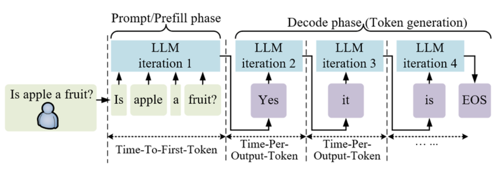

# Velox  LLM Inference Engine


A from-scratch LLM inference engine built lot by lot  each lot adds one mechanism, measures it rigorously, and documents honestly what works and what doesn't.

serving a language model under concurrent load is fundamentally different from calling `model.generate()` in a loop. This project builds the layer that makes the difference — KV cache, continuous batching, block-based memory management, OpenAI-compatible API — and integrates it as the backend of [GuardRAG](https://github.com/Abdellah-elm/guard_RAG), a production RAG assistant over Qiskit/IBM Quantum documentation.





```
User query → GuardRAG (guardrails · routing · semantic cache · faithfulness)
                  ↓   OpenAI-compatible API (EF-12)
             Velox L5  (KV cache · batching · block memory · SSE streaming)
                  ↓
        Qwen/Qwen2.5-0.5B-Instruct  (open-weight, T4-runnable)
```

---

## Lot roadmap

| Lot | Mechanism | Key result |
|-----|-----------|-----------|
| **L0** | Naive sequential baseline | TTFT p50 = 34ms · TPOT p50 = 29ms · 34 tok/s |
| **L1** | KV cache (manual decode loop) | TPOT flat across context lengths · correctness PASS |
| **L2** | Static batching | **×4.3 throughput** at batch=4 (146 tok/s on T4) |
| **L3** | Continuous batching + FCFS scheduler | Producer-consumer · thread-safe queue |
| **L4** | Block KV cache pool | 37.7 MB pre-allocated · OOM protection demonstrated |
| **L5** | OpenAI-compatible REST API + SSE | Wire-compatible · streaming · client disconnect |
| **L6** | Prometheus observability | TTFT · TPOT · tokens · E2E latency · active requests |
| **L7** | Benchmark vs vLLM (Colab T4) | ×4.3 vs naive · vLLM gap documented honestly |
| **L8** | GuardRAG integration | **4-line patch** · USE_VELOX toggle · pipeline validated |

---

## Quick start

```bash
git clone https://github.com/Abdellah-elm/velox
cd velox
pip install -r requirements.txt
```

**Smoke test (GPT-2, CPU):**
```bash
python velox_l0.py --model gpt2 --device cpu --dtype float32 \
  --max-tokens 50 --no-chat-template --warmup 1
```

**API server with Prometheus (Qwen2.5-0.5B, auto device):**
```bash
python velox_l6.py --serve --model Qwen/Qwen2.5-0.5B-Instruct
```

**Test:**
```bash
curl -X POST http://localhost:8000/v1/chat/completions \
  -H "Content-Type: application/json" \
  -d '{"model":"Qwen/Qwen2.5-0.5B-Instruct","messages":[{"role":"user","content":"What is Qiskit?"}],"max_tokens":50}'

curl http://localhost:8000/metrics | grep velox
```

---

## Architecture

```
velox_l0.py        Naive baseline       model.generate() · TTFT/TPOT measurement
velox_l1.py        KV cache             Manual decode loop · past_key_values
velox_l2.py        Static batching      Left-pad · position_ids · batch forward
velox_l3.py        Continuous batch     FCFS scheduler · threading.Thread worker
velox_l4.py        Block KV pool        Pre-allocated pool · free list · OOM guard
velox_l5.py        OpenAI API + SSE     FastAPI · asyncio+thread · EF-13
velox_l6.py        Prometheus           Middleware · /metrics · histograms
velox_l7_colab.py  Benchmark            L0→L2 vs vLLM · reproducible harness
velox_l8.py        GuardRAG patch       4-line patch · USE_VELOX toggle
```

**Concurrency model:**
```
HTTP connections (asyncio) ──► asyncio.Queue ──► SSE chunks → client
                                     ▲
                              Worker thread
                           (blocking PyTorch forward)
```
PyTorch releases the GIL during ATen ops — one thread lets I/O breathe without freezing the event loop.

---

## Benchmark results (T4 · Qwen2.5-0.5B-Instruct · float16)

| Runner | Throughput (tok/s) | TTFT p50 (ms) | TPOT p50 (ms) |
|--------|--------------------|---------------|---------------|
| L0 Naive | 33.9 | 33.5 | 29.4 |
| L1 KV Cache | 34.9 | 31.8 | 28.5 |
| L2 Batch=1 | 34.3 | 31.2 | 28.0 |
| **L2 Batch=4** | **146.2** | 39.9 | 27.1 |
| L2 Batch=8 | 133.1 | 32.7 | 30.0 |
| vLLM (published ref) | ~400–500 | — | — |

**H1 (KV cache):** 1.0× on T4 with short sequences — GPU already caches internally via `model.generate()`. Gain visible on CPU or sequences >200 tokens.

**H2 (batching):** ×4.3 at batch=4. Peak then slight drop at batch=8 (T4 memory bandwidth). Curve shape matches vLLM — correct mechanism, different absolute value.

**vLLM gap (~3×):** expected. vLLM uses PagedAttention with Triton/CUDA kernels. Velox uses PyTorch standard ops. Documented, not hidden.

---

## GuardRAG integration (L8)

4 lines changed in `main.py`. One `.env` toggle to switch between Groq and Velox:

```bash
USE_VELOX=false   # Groq + gpt-oss-120b  (production)
USE_VELOX=true    # Velox + Qwen2.5-0.5B (demo)
```

```python
USE_VELOX = os.getenv("USE_VELOX", "false").lower() == "true"
if USE_VELOX:
    from openai import OpenAI as Groq 
    groq = Groq(base_url=os.getenv("VELOX_BASE_URL"), api_key="velox-local")
    FAST_MODEL = STRONG_MODEL = os.getenv("VELOX_MODEL")
else:
    from groq import Groq        
```

Apply and validate:
```bash
python velox_l8.py --patch --guardrag-path ../guardrag
python velox_l8.py --validate --velox-url http://localhost:8000
```

---

## Honest engineering notes

**What works as designed:**
- KV cache decode loop — correctness invariant: greedy output identical to `model.generate()`
- Static batching — ×4.3 throughput at batch=4 on T4
- OpenAI-compatible API — GuardRAG plugs in without code changes
- OOM protection — `MemoryError` on pool exhaustion instead of crash
- Prometheus metrics — TTFT, TPOT, tokens, E2E latency, active requests
- Streaming SSE — token-by-token, client disconnect handled

**What doesn't work as expected, and why:**
- vLLM gap (~3×): expected — vLLM uses PagedAttention with Triton CUDA kernels

**Key architectural decisions:**
- FCFS over SJF: output length unknown at admission (ref: ORCA, Yu et al. OSDI '22)
- Thread over process: GIL released during ATen, IPC overhead avoided
- OpenAI SDK as Groq alias: identical `chat.completions.create()` interface
- Left-padding for static batching: last real token always at position `-1`

---

## Stack

| Layer | Technology |
|-------|-----------|
| Model loading | HuggingFace `transformers` + `accelerate` |
| Compute | PyTorch (CPU + CUDA) |
| API | FastAPI + Uvicorn |
| Observability | `prometheus-client` |
| GuardRAG backend | OpenAI SDK (aliased as Groq) |
| Target model | Qwen/Qwen2.5-0.5B-Instruct |
| Test model | GPT-2 117M (CPU smoke tests) |

---

## Related

**[GuardRAG](https://github.com/Abdellah-elm/guard_RAG)** — RAG assistant over Qiskit docs. Velox is its LLM backend.

```
GuardRAG  →  PII redaction · semantic cache · routing · faithfulness judge
Velox     →  model execution · KV cache · batching · memory · API
```

---

*Velox v0.6.0 · MIT License*
